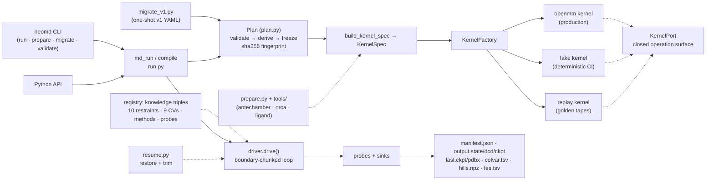

# NeoDynamics

[](https://github.com/NeoBinder/NeoDynamics/actions/workflows/ci.yml)

**A molecular-dynamics SDK on OpenMM** — generic MD, well-tempered
metadynamics, steered MD and OPES behind a single facade, with a swappable
physics kernel.

Python 3.12+ · OpenMM 8.6.x · MIT license · version derived from git tags

NeoDynamics is NeoBinder's open-source project for molecular dynamics built
on top of [OpenMM](https://openmm.org/). The package contains:

- OpenMM pipelines for generic MD (`min` / `eq` / `md` / `prod`),
  well-tempered metadynamics, steered MD and OPES (QM/MM, GaMD and
  ML-powered MD are planned as 2.x plugins — see the extension section
  below)
- OpenMM system-building tools (protein + ligand + solvent)
- Ligand forcefield creation and support for externally supplied ligand
  forcefields (AM1-BCC/GAFF via antechamber, RESP2 charges via ORCA, or
  expert-designed parameters)

> Since **v0.2.0** (the 2026-08-27 flip) the v2 architecture under
> `src/neomd/` is the only active codebase. `src/neomd_legacy/` is the
> frozen v1 package, kept for one deprecation release together with the
> `neomd2` script alias and the `bin/` compatibility wrappers.

## Highlights

- **One facade, progressive disclosure** — `md_run(dir)` → scalar kwargs →
  full plan dict all compile to an *identical* immutable `Plan` (same sha256
  fingerprint; pinned by the round-trip test).
- **Validate everything at once** — plan validation collects *all* problems
  (not fail-on-first) and renders each with its YAML key path and a
  did-you-mean suggestion. `neomd validate plan.yaml --check-files` reports
  every issue, writes nothing, exits 2.
- **A closed physics seam (`KernelPort`)** with three adapters:
  `openmm` (production), `fake` (deterministic, openmm-free, millisecond CI),
  `replay` (golden-tape playback pinning bit-exact parity with v1).
- **Knowledge triples + registry** — restraints, collective variables,
  methods and probes are self-registering triples (schema + physics +
  observables); third-party plugins register through `neomd.register()` or
  the `"neomd"` entry-point group.
- **Deterministic resume** — a single owner restores the checkpoint and
  trims every tape to the resume step; `manifest.json` chains epochs and
  records the plan fingerprint.

## Quick start

### Python — one facade, three depths

```python
from neomd import md_run

md_run("path/to/run_dir")                # L0: zero-config (reads the plan file in the dir)
md_run("path/to/run_dir", steps=50000)   # L1: scalar knobs deepen the plan
md_run(plan_dict)                        # L2: the full experiment spec
```

The **round-trip law**: L0, L1 and L2 spellings of the same experiment
compile to an identical `Plan` — one validation path, one sha256 fingerprint.

### Shell

```bash
neomd run path/to/run_dir --steps 50000 --platform cpu   # --kernel openmm|fake|replay
neomd prepare prep_config.yaml                            # system preparation (protein+ligand+solvent)
neomd migrate old_v1_config.yaml -o plan.yaml             # one-shot v1 YAML -> Plan translation
neomd validate plan.yaml --check-files                    # report every problem, write nothing
neomd analysis fes path/to/run_dir                        # post-run analysis (see "Analyzing runs")
neomd version
```

### A plan file

```yaml
method: eq
steps: 5000

integrator:
  dt: 0.002
  friction_coeff: 1.0
barostat:
  frequency: 25
  pressure: 1.0
temperature: 298
seed: 0

input_files:
  complex: /work_dir/min/last.pdbx        # from the previous leg
  system: /work_dir/sys_prep/htb/system.xml
  ligands: /work_dir/sys_prep/htb/ligand.json

output:
  output_dir: /work_dir/eq
  trajectory_interval: 1000
  checkpoint_interval: 1000
```

Metadynamics swaps in `method: metadynamics`, a `colvars:` section
(1–3 collective variables from the CV vocabulary) and a `meta_set:`
section (`biasFactor`, `height`, `frequency`) — same facade, same artifacts
plus `colvar.tsv`, `hills.npz` and `fes.tsv`. Complete, runnable examples:
[examples/3HTB_complex/](examples/3HTB_complex/) (protein–ligand complex,
with the [run_v2.py](examples/3HTB_complex/run_v2.py) walkthrough) and
[examples/ala_meta/](examples/ala_meta/) (alanine-dipeptide metadynamics).

OPES swaps in `method: opes` with the same `colvars:` section and an
`opes_set:` section that takes exactly the method's three inputs — `pace`,
`barrier` (the expected free-energy barrier, kJ/mol; γ/ε/kernel cutoff are
all derived from it — no `biasFactor`/`height` keys) and optionally
`mode: standard|explore`. Every `pace` steps the method deposits one
(compressed) KDE kernel, refreshes the explored-region normalization Z_n
and pushes the new bias table through the same seam metadynamics uses;
artifacts add `kernels.npz` (the kernel ledger, replayed deterministically
on `continue_md`), `colvar.tsv` and `fes.tsv`, and `neomd.analysis` reads
the tapes back. Background (issue #11), the full parameter walkthrough, a
runnable YAML plan and the architecture notes live in
[docs/methods/opes.md](docs/methods/opes.md).

Steered MD swaps in `method: smd` and an `smd:` section whose entries use
the restraint vocabulary — any rampable key (`restr_k`, `max_nm`,
`min_degree`, `order`, `maxRMSD_nm`, `ref_position_nm`, ...) given a LIST
of values is piecewise-linearly interpolated over `steps` and pushed to the
kernel on a fixed 5000-step staircase (v1 semantics, verbatim). A classic
pull is a `max_nm`/`ref_position_nm` ramp; a soft engage/release is a
`restr_k` ramp like `[0, 1000, ..., 0]`. The run writes `smd.tsv` (step +
geometric observable + current ramp values + bias energy; switch it off
with `output.report_smd: false`) alongside the usual artifacts, and a
static `restraint:` section (e.g. holding the protein) is reported to
`restraint.tsv` as in any MD run.

The `boresch` restraint type — a v2-native orientation restraint holding a
ligand to a receptor through 6 components over 3+3 anchor atoms (Boresch
2003), the standard RBFE anchor, packed like `distances` into one force
per expression kind — is documented with a full YAML example, the anchor
geometry and the v2 decisions in
[docs/methods/boresch.md](docs/methods/boresch.md).

## Installation

### (*preferred*) Pixi — custom runtime environment

1. Install [pixi](https://pixi.sh/latest/#alternative-installation-methods)
```bash
curl -fsSL https://pixi.sh/install.sh | sh
```

2. Install the package into your own environment
```bash
mkdir -p /path/to/env && cd /path/to/env
pixi init neomd && cd neomd
pixi add "python==3.12.*"
# git installation
pixi add --pypi "neodynamics @ git+https://github.com/NeoBinder/NeoDynamics"
# local installation
pixi add --pypi "neodynamics @ file:///path/to/NeoDynamics"

pixi add my_custom_conda_package
pixi add --pypi my_custom_pypi_package
pixi shell
```

### Pixi — development environment

```bash
git clone git@github.com:NeoBinder/NeoDynamics.git
cd NeoDynamics
pixi install
pixi shell
```

### Conda

```bash
git clone git@github.com:NeoBinder/NeoDynamics.git
cd NeoDynamics
conda env create --name neomd -f environment.yaml
conda activate neomd
pip install -e ./    # development-mode installation
```

## The model in one minute



### Plan — the immutable experiment snapshot

Every experiment becomes a `Plan` exactly once: **validate** (collect every
problem; errors carry the YAML key path and a did-you-mean), **derive**
(seed/temperature defaults, intervals, `continue_md` checkpoint resolution),
**freeze** (deep-frozen dict; `plan.with_(...)` returns a re-validated copy),
then a sha256 **fingerprint**. `Plan` equality *is* fingerprint equality.

### The kernel seam — `KernelPort` and three adapters

| Adapter | Role | Needs OpenMM? | Negotiated capabilities |
|---|---|---|---|
| `openmm` | production runs | yes — the only core module importing openmm | `BiasOps`, `GroupEnergy`, `StructureWriter` |
| `fake` | deterministic textbook Langevin; millisecond, openmm-free CI workhorse | no (numpy) | `BiasOps`, `GroupEnergy` |
| `replay` | plays back recorded v1 golden tapes for parity tests | no | — (unsupported columns report `nan`) |

The port is a closed operation surface (step, minimize, positions/energies,
`install_bias` → opaque force-group id, snapshot/restore) plus *optional*
capability protocols negotiated via `provides()`. Force-group ids are opaque
ints, allocated by the single `pick_free_force_group` allocator. The `replay`
adapter registers on import, so `import neomd.kernel.replay` must happen
before `KernelFactory.create(kind="replay")`.

### Knowledge triples and the registry

One module per restraint / collective variable / method / probe, each
holding **schema + force expression + observables**, injected via
`registry.register(kind, name, entry)`. Method doc with the W1-b CV
spellings, dual-track kernels and hand-computed geometry pins:
[docs/methods/cv-library.md](docs/methods/cv-library.md). Built-ins: 10 restraint types
(`distance`, `dihedral`, `angle`, `funnel`, `dist_ref_position`, `xyz_box`,
`vec_restraint`, `rmsd`, `distances` — many pairs packed into one force
per side, the v1 179ae35 group-economy type — and `boresch`, the
v2-native orientation restraint for RBFE: 6 components over 3+3 anchor
atoms packed into one force per expression kind), 9 CVs — the 5 v1-ported
expression CVs (`distance`, `dihedral`, `angle`, `min_distances`,
`distance_ref`) plus the W1-b kind-driven CVs `rmsd` (Kabsch optimal-rotation
RMSD to a reference), `coordination` (PLUMED-style rational switching pair
sum between two atom groups) and `path_s`/`path_z` (Branduardi–Gervasio–
Parrinello path progress and distance over multi-model reference frames) —
the well-tempered `metadynamics`, steered-MD (`smd`) and OPES (`opes`,
standard + explore modes) methods, and 6 probe presets. v1 physics expressions are ported verbatim — that is physics, not
architecture; the W1-b CVs are new physics from the primary literature
(colvars.py documents the citations, kernels and representation).

### Driver, probes, sinks — what a run writes

| File | Writer | Content |
|---|---|---|
| `manifest.json` | driver (atomically rewritten during the run) | plan fingerprint + raw plan, versions, epoch chain (`resume:<step>`, `done:<method>`), last step per artifact |
| `output.state` | `StateProbe` | energy log, OpenMM StateDataReporter format |
| `output.dcd` | `TrajectoryProbe` | CHARMM-compatible DCD trajectory (append-aware, trimmable) |
| `output.ckpt` | `CheckpointProbe` + final write | kernel checkpoint incl. RNG state |
| `last.ckpt`, `last.pdbx` | driver, at leg end | final snapshot (+ final structure when the kernel provides `StructureWriter`; the pdbx header carries the RUNTIME periodic box — v1 8d04b0c fix — and fresh starts take the initial box from the structure file's header) |
| `restraint.tsv` | `RestraintProbe` | restraint observables + `__energy` via `GroupEnergy` |
| `smd.tsv` | `SmdProbe` (steered MD) | per-entry geometric observable + current ramp values + `__energy` (switch: `output.report_smd`) |
| `colvar.tsv` | `ColvarProbe` (metadynamics / opes) | CV values in natural units (e.g. degrees) |
| `hills.npz` | metadynamics | hill ledger `{steps, positions, heights}` |
| `kernels.npz` | opes | kernel ledger `{steps, positions, sigmas, heights, logweights}` (pre-compression deposits; the resume replay state) |
| `fes.tsv` | metadynamics / opes | free-energy surface at run end |
| `fes.tsv` | metadynamics | free-energy surface at run end |
| `qc_report.json` | `neomd.qc` (hooks below) | structure quality report: every finding with atom indices, measured value, threshold, per-check + overall verdict |

All writing goes through `ArtifactSink` implementations (`LocalDirSink` for
runs, `MemorySink` for tests) — `md_run` itself writes nothing.

### Structure quality checks (`qc`) — openmm-free

Method doc with issue #7/#15 background, threshold calibration and the
report schema: [docs/methods/qc.md](docs/methods/qc.md).

`neomd.qc` is a pure-numpy geometry module (no openmm import, not routed
through the kernel port): it reads coordinates from the topology file
(or the live minimized coordinates) and equilibrium values from the
serialized `system.xml`, then runs every check in one collect-all pass —
NaN/Inf coordinates, atoms escaping the periodic box, PBC-aware
minimum-image clashes (1-2/1-3/1-4 bonded pairs excluded), bond-length
deviations from the system's own `r0`s, and angle deviations from its
`theta0`s. When the system carries a ligand (`input_files.ligands`), the
same checks run scoped to it and report under a `ligand` block; an absent
ligand is `skipped`, never an error.

Two hooks write `qc_report.json` through the sink: the tail of
`prepare_system` (over the freshly written `solv.pdbx`/`system.xml`) and
the tail of every `min` leg (over the minimized coordinates — the failure
mode issue #7 documented, a minimize that leaves broken geometry behind).
Configure through the plan's `qc:` section; everything is optional:

```yaml
qc:
  mode: soft                # soft (default): report only; strict: raise
                            # StructureQualityError after the report is written
  clash_heavy_nm: 0.2       # heavy-heavy clash line (2.0 A — below the
                            # shortest legitimate H-bond donor/acceptor pair)
  clash_hydrogen_nm: 0.1    # pairs involving H (H-bond H...acceptor ~1.5 A)
  bond_relative_tolerance: 0.25   # |r - r0| fraction (floor: 0.03 nm)
  bond_absolute_nm: 0.03
  angle_tolerance_deg: 30   # |theta - theta0|
  box_escape_fraction: 0.5  # > half a box outside the cell = broken
```

The defaults are calibrated against the issue #7 repro data (its broken
minimize left bonds 53 % off and angles 57 deg off, while healthy minimized
structures sit within ~1 % / ~3 deg) and the shipped fixtures: the minimized
3HTB smoke and the ala2 micro-fixture pass with zero findings. `soft` is
the default because raw preparation inputs routinely carry fixable clashes
— minimization is exactly what resolves them; `strict` is the opt-in gate
for pipelines that want one. `neomd validate` checks the `qc:` section with
the usual collect-all diagnostics (key path + did-you-mean).

### Resume — deterministic continuation

Set `continue_md: true` and the same plan re-runs from its checkpoint:
`resume.plan_resume` is the single owner that restores the kernel and trims
*every* tape (`output.state`, `output.dcd`, `colvar.tsv`, `restraint.tsv`,
`hills.npz`, `kernels.npz`, `smd.tsv`) to the resume step, then the probes re-open them in
append mode. Probes never decide append/truncate themselves. A resumed SMD
run snaps its ramp push to the enclosing 5000-step boundary, so the
staircase is identical to an uninterrupted run's; a resumed metadynamics
or OPES run replays its (trimmed) ledger through the same deposit math,
so kernels and hills are bit-identical to an uninterrupted run's.

### System preparation and tools

`neomd prepare prep.yaml` (or `prepare_system(config)`) builds
protein + ligand + solvent systems and writes `solv.pdbx`, `system.xml` and
`ligand.json`. External binaries are wrapped by subprocess-isolated adapters
in `tools/`: `antechamber` (GAFF parameterisation), `orca` + Multiwfn (RESP2
charge fitting), `ligand` (RDKit/openff processing), `convert`, `fix_protein`
(PDBFixer) and `template_xml`. All OpenMM private-API usage lives in
`openmm_privates.py` behind a pinned-version gate (openmm 8.6.x) that raises
`UpstreamVersionError` otherwise.

## Analyzing runs

Method doc with background, conventions and the analytic double-well test
suite: [docs/methods/analysis.md](docs/methods/analysis.md).

`neomd analysis` (the `neomd.analysis` subpackage behind it) reads the v2
artifact formats — `colvar.tsv`, `hills.npz`, `smd.tsv` — plus the run
manifest, which is where the grid metadata lives. No v1 compatibility and no
plotting: outputs are tsv/json to stdout or `--out` files. numpy-only,
deterministic, openmm-free.

```bash
neomd analysis fes run_dir --out fes.tsv          # WT FES from hills (same
                                                  # layout as the run's own
                                                  # fes.tsv; --bins N for a
                                                  # custom-resolution grid)
neomd analysis convergence run_dir --blocks 4     # window-split max/mean
                                                  # |dFES| table (收敛差值)
neomd analysis block-average run_dir --column phi # mean + statistical error
                                                  # of a tape column (also
                                                  # accepts a .tsv directly)
neomd analysis reweight run_dir --observable phi \ # Tiwary-Parrinello c(t)
    --cv phi --fes-out rw_fes.tsv                 # reweighting (+ profile)
neomd analysis merge walker_a walker_b --out merged # multi-walker hills
                                                    # merge into one run dir
```

Several `RUN_DIR`s merge on the fly (multi-walker hills) wherever the
command accepts them. Conventions worth knowing:

- the FES estimator is the producer's own well-tempered relation
  `FES = -((T+dT)/dT) * bias`, `dT = T*(biasFactor-1)`; the ledger replay is
  bit-identical to the running method's bias (pinned by tests);
- `hills.npz` positions are in kernel units (radians for angular CVs) while
  `colvar.tsv` carries natural units (degrees) — the analysis converts
  through the same port table the run used;
- reweighting needs no bias column in the tape: `c(t)` is rebuilt from the
  hills deposited strictly before each colvar row (the bias that row was
  actually sampled under — probes fire before hill deposition).

The same surface is importable for programs (`from neomd.analysis import
fes_from_hills, block_average, reweight_expectation, ...`) — it is the
shared base the GaMD reweighting, OPES, RBFE (BAR/MBAR) and ML-CV
convergence work builds on. Flooding-style dynamics analysis is a
documented follow-up: the new formats do not define the quantity yet.

## Extending NeoDynamics

Register a knowledge triple — the registry is the public plugin surface
(`neomd.register`). A method plugin mirrors the metadynamics shape
(`schema` + `prepare(kernel, plan, sink, logger) -> PreparedMethod`):
install your biases, then hand the driver your `on_step` hook, tape probes
and a `finish` — the driver runs the loop and owns all reporting (the
restraint tape, and whether your tapes run at all). Importing your
module self-registers:

```python
from types import SimpleNamespace
from neomd.driver import PreparedMethod
from neomd.kernel.port import BiasIR, Param
from neomd.registry import PluginSection, register

SCHEMA = {
    "required": {"steps": "int", "temperature": "number (K)"},
    "optional": {"plugins.my_method": "settings under plugins.my_method.*"},
}

def prepare(kernel, plan, sink=None, logger=None):
    settings = plan.plugins.get("my_method") or {}   # your plan section
    bias = BiasIR(
        kind="CustomCentroidBondForce",
        energy="0.0*k",                       # your potential expression here
        params={"k": Param(0.0, "dimensionless")},
        groups=[[0], [1]],
        periodic=False,
        label="my_method",
    )
    fgroup = kernel.install_bias(bias)         # opaque force-group id

    def finish(result):                        # end-of-run artifacts
        from neomd.driver import CHECKPOINT_FILENAME
        if sink is not None:
            sink.write_bytes(CHECKPOINT_FILENAME, kernel.snapshot())
        return result

    return PreparedMethod(
        fgroups={"my_method": [fgroup]},       # informational
        finish=finish,
        # on_step=..., on_step_interval=..., tapes={...} as needed
    )

register("method", "my_method", SimpleNamespace(schema=SCHEMA, prepare=prepare))

# the plan section your plugin owns under plugins.<name>.* (ADR-0002)
register("plugin", "my_method", PluginSection(
    required={},
    optional={"k": "dimensionless amplitude of the placeholder bias"},
))
```

Notes: plugin settings live in the first-class `plugins:` plan namespace
(ADR-0002) — `register("plugin", <name>, PluginSection(required=...,
optional=...))` declares the keys you own under `plugins.<name>.*`; plan
validation checks names and keys collect-all (yaml key path +
did-you-mean, required-key presence in `neomd validate --check-files`),
values are yours to interpret, and the section rides the plan fingerprint.
`plan.KNOWN_KEYS` itself stays closed. For installable distributions,
declare the `"neomd"` entry-point group:

```toml
[project.entry-points."neomd"]
my_method = "my_package"      # importing my_package self-registers
```

The facade (`md_run`, `compile` on a dict, `neomd validate`) scans that
group before any Plan is built, so installed plugins validate and dispatch
automatically.

A complete, tested drill lives in
[examples/gamd_drill/](examples/gamd_drill/) — an out-of-tree mini-distribution
validating registration, entry-point discovery, `drive()` dispatch (fake and
openmm kernels) and the plugin plan-schema namespace.

## Migrating from v1

`neomd migrate old_config.yaml -o plan.yaml` (or
`python -m neomd.migrate_v1`) translates a v1 run config into a v2 plan:
dead keys produce warnings, `method` synonyms map (`minimization → min`,
`equilibration → eq`), paths are absolutised against `--base-dir`, and
validation errors are relocated to the original YAML `file:line`. `qmmm`
configs are rejected (broken in v1; it returns as a 2.x plugin). The
translator is a one-shot tool, not a compatibility layer. The old `bin/`
entry points remain thin wrappers for one release.

## Testing and CI

```bash
pixi run test          # pytest -m 'not golden and not legacy' — the CI gate (~6 min)
pixi run test-golden   # bit-exact parity vs recorded v1 tapes (~3 min)
pixi run test-legacy   # frozen-v1 live tests (opt-in, not in CI)
uvx ruff check .       # the lint gate (also enforced by pre-commit.ci on every PR)
```

Every PR also runs [pre-commit.ci](https://pre-commit.ci) over
`.pre-commit-config.yaml` — check-only hooks (basic file sanity plus the
ruff lint gate, configured in `pyproject.toml` with the frozen v1 code in
`src/neomd_legacy/`, `bin/` and `examples/` excluded). Run everything
locally with `uvx pre-commit run --all-files`.

- `tests/v2/` — unit + e2e over public interfaces on the fake kernel
  (millisecond tier), including the round-trip-law test and **source-scan
  tests** that enforce the architecture: no `kernel.simulation` reach-through
  outside `kernel/`, no openmm private API outside `openmm_privates.py`.
- `tests/golden/` — the record / trim / compare harness and 9 committed v1
  tapes. Golden comparisons are bit-exact in CI; across environments use
  `NEO_GOLDEN_TOLERANT=1` for the statistical tier. Golden samples catch
  behavior changes; they do not prove physical correctness.

## Repository layout

```
NeoDynamics/
├── src/neomd/                 # the active v2 package
│   ├── run.py                 # md_run facade + compile + build_kernel_spec
│   ├── cli.py                 # neomd console script (run/prepare/migrate/validate/version)
│   ├── plan.py                # immutable Plan: validate → derive → freeze → fingerprint
│   ├── errors.py              # NeoUserError family + did-you-mean suggestions
│   ├── driver.py              # stepping loop, scheduling, RunOutcome
│   ├── resume.py              # THE resume owner: restore + trim every tape
│   ├── manifest.py            # fingerprint + epoch-chain provenance
│   ├── probes.py / sinks.py   # all artifact writing (LocalDirSink, MemorySink, DCD writer)
│   ├── system.py / prepare.py # openmm-free SystemBundle + preparation workflow
│   ├── openmm_privates.py     # ALL private-API touches behind an openmm 8.6.x gate
│   ├── restraints.py          # 10 restraint knowledge triples (incl. boresch)
│   ├── colvars.py             # 9 collective-variable triples (5 expression + 4 kind-driven)
│   ├── registry.py            # the extension rack (restraint/cv/method/probe)
│   ├── methods/metadynamics.py# well-tempered metadynamics
│   ├── analysis/              # post-run analysis: readers, WT FES, convergence,
│   │                          # block averaging, TP reweighting, multi-walker
│   │                          # merge (+ the `neomd analysis` CLI commands)
│   ├── kernel/                # KernelPort seam: port.py + openmm/fake/replay adapters
│   ├── tools/                 # external-process adapters (antechamber, orca, ligand, ...)
│   └── migrate_v1.py          # one-shot v1 YAML → Plan translator (a tool, not runtime)
├── src/neomd_legacy/          # frozen v1 (bug fixes only, one deprecation release)
├── tests/v2/                  # unit + e2e on the fake kernel
├── tests/golden/              # golden-tape harness + 9 committed v1 tapes
├── examples/                  # 3HTB_complex walkthrough, ala_meta, gamd_drill plugin
├── docs/                      # v2 migration plan, improvements log, DAG board, ADR
└── bin/                       # thin v1 compatibility wrappers + standalone
                                # v1 analysis tools (protein/trajectory/
                                # parse_ff_params — heavy deps, own env)
```

## Documentation

- [AGENTS.md](AGENTS.md) — development workflow (worktree), working discipline and settled architecture decisions
- [docs/v2-migration-plan.md](docs/v2-migration-plan.md) — the full strangler-migration record (decisions, phases, flip day)
- [docs/v2-improvements.md](docs/v2-improvements.md) — post-flip improvement items and settled debates
- [docs/v2-dag.md](docs/v2-dag.md) — execution board and post-flip verification numbers
- [docs/adr/0001-neomd2-strangler-migration.md](docs/adr/0001-neomd2-strangler-migration.md) — ADR: why a same-repo strangler migration

## Versioning and license

Version numbers are derived from git tags via
[versioningit](https://github.com/jwodder/versioningit) — nothing is
hardcoded. OpenMM upgrades are explicit events: the version is pinned in
`pixi.toml`, the `openmm_privates.py` gate is re-verified and golden tapes
re-recorded. MIT license — see [LICENSE](LICENSE).
